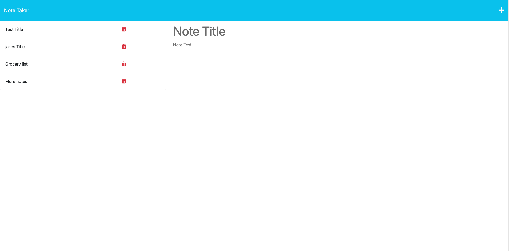

  # Note Taker

  

  ## Description

  https://shrouded-harbor-38847.herokuapp.com/
  
  This project was made using JavaScript and Express to experiment with routes. The purpose of the application is to store notes the user inputs, into a database and from there it is posting it onto the HTML as a saved note. This project was intentially used for me to learn routes and use databases to store information as objects. The user experience of this project, will give the user an option to add a title for their note and their note, and from there all saved notes will be viewable on the left hand side or the user to select between. 
  
  ## Table of Contents
  
  - [Installation](#installation)
  - [Usage](#usage)
  - [License](#license)
  - [Contributing](#contributing)
  - [Tests](#tests)
  - [Contact](#contact)
  
  ## Installation
  
  In order to install the depencencies, the user will need to open the integrated terminal and type "npm i". In order to actually run the live server, the user will need to type "npm start" in the terminal for the application to be deployed on the local server. They will be able to view the link that the intigrated terminal provides after typing the commands. 
  
  ## Usage
  
  The user can use this application using the following link https://shrouded-harbor-38847.herokuapp.com/. The user will be able to use this to store random notes that they would like in the future. This can nn also be used to  ealook at differnet notes the user has nade in the past

  
  
  ## License

  This project is licensed under:https://opensource.org/licenses/MIT
  
  ## Badges
  
    
  ## Contributing
  
  In order to contribute to this code, the user will just need to either provide me credit in their projects used or they will need to reach out to me directly at the contacts below. 

  ## Tests
  
  There are no tests done for this project

  ## Contact

  You can view my github at https://www.github.com/Jvanduyn.
  You can email me at jcvanduyn@yahoo.com.
